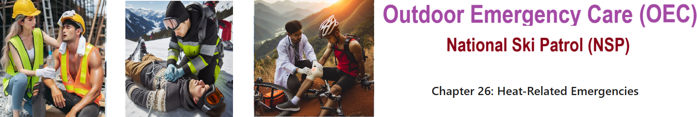
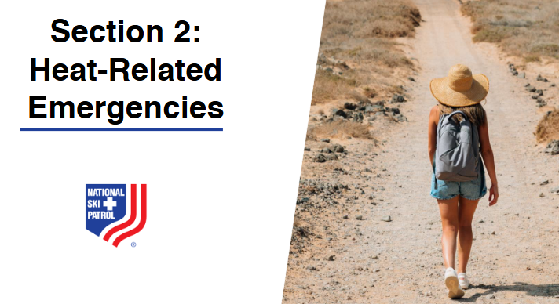
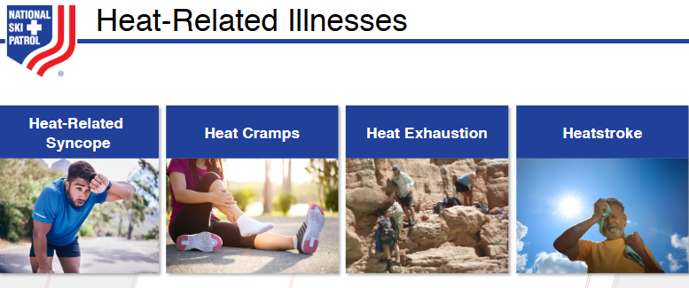

    
# Nsp Oec Training Chapter 26 

## National Ski Patrol - Outdoor Emergency Care chapter 26

    

    
## Chapter 26: Heat-Related Emergencies

1. Explain how to prevent heat-related illness.
2. Explain how the body adjusts to a hot environment.
3. List the signs and symptoms of a patient with the four types of heat-related illness. 
4. Describe and demonstrate the assessment and management of a patient suffering from each of the four types of heat-related illness.

## 26.1 Explain how to prevent heat-related illness.

Preventing heat-related illnesses involves taking steps to reduce exposure to high temperatures, staying hydrated, and recognizing the early signs of heat stress. Here are several key ways to prevent heat-related illnesses:

### **1. Stay Hydrated**
   - **Drink Plenty of Water**: Drink water regularly, even if you do not feel thirsty, especially during hot weather or when engaging in physical activity. Aim for at least **8-10 cups of water** a day, more if you are active.
   - **Avoid Alcohol and Caffeine**: Limit or avoid **alcohol, caffeine, and sugary drinks**, as they can lead to dehydration.

### **2. Limit Outdoor Activities During Peak Heat**
   - **Avoid the Hottest Parts of the Day**: Try to schedule outdoor activities during the **cooler parts of the day**, such as early morning or late evening.
   - **Take Frequent Breaks**: If you need to be outside, take regular breaks in the shade or indoors to cool down.

### **3. Wear Appropriate Clothing**
   - **Light, Loose-Fitting Clothing**: Wear **light-colored, loose-fitting, and lightweight clothing** to allow your body to cool more easily.
   - **Wide-Brimmed Hats and Sunglasses**: Protect yourself from the sun by wearing a **hat** that shades your face, neck, and ears, and **sunglasses** to protect your eyes.

### **4. Use Sunscreen**
   - **Apply Sunscreen Regularly**: Use a broad-spectrum **sunscreen with SPF 30 or higher**, and reapply every **two hours** and after swimming or sweating. Sunburn affects the body's ability to cool down and can increase the risk of dehydration.

### **5. Stay in Cool, Shaded, or Air-Conditioned Areas**
   - **Seek Air Conditioning**: Spend time in **air-conditioned** buildings during extreme heat, such as shopping malls, libraries, or cooling centers, if your home is not air-conditioned.
   - **Use Fans and Shade**: If air conditioning is not available, use **fans, cool showers, and shaded areas** to help lower your body temperature.

### **6. Plan Activities Wisely**
   - **Know Your Limits**: Reduce or avoid strenuous activities during hot weather. If you must be active, gradually **acclimatize** to the heat over several days.
   - **Take it Slow**: Start slowly, and if you feel dizzy, weak, or overheated, stop and rest in a cool place.

### **7. Monitor for Signs of Heat-Related Illness**
   - **Know the Symptoms**: Be aware of the early signs of heat-related illnesses, such as **heavy sweating, muscle cramps, dizziness, headache, nausea, and rapid heartbeat**. Take action immediately if symptoms appear.
   - **Check on Others**: Regularly **check on children, the elderly, and those with chronic health conditions** during hot weather, as they are more vulnerable to heat-related illnesses.

### **8. Use Cooling Strategies**
   - **Cool Down Quickly**: Use **cool, wet cloths, misting, or cool baths** to lower body temperature if you start feeling overheated.
   - **Stay Out of Direct Sunlight**: Find shade or use **umbrellas** if you need to be outside for extended periods.

### **9. Adjust Meals and Hydration**
   - **Eat Light Meals**: Consume smaller, lighter meals, and avoid heavy, hot foods that can increase body heat.
   - **Hydrating Foods**: Eat foods with high water content, such as **fruits (watermelon, cucumber, oranges)** to help maintain hydration.

### **10. Prepare for Extreme Heat**
   - **Stay Informed**: Pay attention to local weather forecasts and heat advisories, and plan activities accordingly.
   - **Create a Cool Environment**: Use **curtains, shades, or reflective materials** to block out sunlight and keep your living space cooler.

By following these guidelines, you can significantly reduce the risk of heat-related illnesses, stay safe, and enjoy the warmer weather responsibly.

## 26.2 Explain how the body adjusts to a hot environment.

The body adjusts to a hot environment through a process called **heat acclimatization**, which involves several physiological changes that help regulate body temperature and maintain homeostasis. Here’s how the body adapts:

### **1. Increased Sweating**
   - **Enhanced Sweat Production**: In a hot environment, the body produces more sweat, which helps cool the skin as the sweat evaporates. Over time, the body becomes more efficient at **producing sweat** to release heat.
   - **Earlier Onset of Sweating**: With acclimatization, sweating begins **earlier** and at lower temperatures, allowing the body to cool more effectively before overheating occurs.

### **2. Improved Sweat Distribution and Efficiency**
   - **More Dilute Sweat**: The sweat becomes more **dilute**, meaning it contains less salt and electrolytes. This adaptation helps conserve sodium and other essential minerals, reducing the risk of dehydration and muscle cramps.
   - **Better Sweat Distribution**: The body learns to **distribute sweat more evenly** across the skin, maximizing the cooling effect.

### **3. Increased Blood Flow to the Skin**
   - **Vasodilation**: The blood vessels in the skin **widen (vasodilation)** to increase blood flow to the surface, allowing more heat to be transferred from the core to the skin, where it can be released into the environment.
   - **Enhanced Heat Dissipation**: This increased blood flow to the skin helps with **heat dissipation**, cooling the body more effectively.

### **4. Adjusted Heart Rate and Circulation**
   - **Lower Resting Heart Rate**: With acclimatization, the **heart becomes more efficient**, and the resting heart rate decreases, reducing the strain on the cardiovascular system in hot conditions.
   - **Improved Circulatory Efficiency**: The body adjusts by improving the efficiency of blood flow to vital organs and the skin, helping to maintain **stable blood pressure** and effective heat regulation.

### **5. Improved Salt Retention**
   - **Reduced Sodium Loss**: The body adapts by retaining more **sodium** through adjustments in kidney function and sweat gland activity, which helps prevent dehydration and maintain electrolyte balance.
   - **Hormonal Adjustments**: Hormones like **aldosterone** increase, promoting sodium retention and water reabsorption in the kidneys to reduce the risk of dehydration.

### **6. Acclimatization Over Time**
   - **Gradual Adaptation**: The body’s adjustment to a hot environment, known as acclimatization, typically takes **1-2 weeks** of gradual exposure to heat. During this period, the body becomes more efficient at cooling itself and conserving fluids.
   - **Sustained Acclimatization**: Regular exposure to heat can maintain these adaptations, but they can be lost within a few weeks if the body is no longer exposed to hot conditions.

Through these physiological changes, the body becomes more efficient at cooling itself, conserving fluids, and maintaining stable internal conditions, which helps prevent heat-related illnesses and improves performance in hot environments.

## 26.3 List the signs and symptoms of a patient with the four types of heat-related illness. 

Here are the signs and symptoms of the four main types of heat-related illnesses:

### **1. Heat Cramps**
- **Muscle Cramps**: Painful, involuntary muscle spasms, usually in the legs, arms, or abdomen.
- **Heavy Sweating**: Often occurs after intense physical activity in a hot environment.
- **Thirst**: May feel very thirsty due to fluid and electrolyte loss.
- **Fatigue**: Mild to moderate tiredness.

### **2. Heat Exhaustion**
- **Heavy Sweating**: Excessive perspiration, with cool, moist skin.
- **Pale or Flushed Skin**: The skin may appear pale or slightly red.
- **Weak, Rapid Pulse**: Heart rate may increase due to fluid loss.
- **Nausea or Vomiting**: May feel sick to the stomach or have an upset stomach.
- **Muscle Cramps**: Painful spasms, often in the legs or abdomen.
- **Dizziness or Fainting**: Lightheadedness, feeling faint, or even losing consciousness.
- **Headache**: Persistent, throbbing headache.
- **Fatigue or Weakness**: Extreme tiredness and weakness, often with a feeling of being overwhelmed.

### **3. Heat Syncope (Fainting)**
- **Dizziness or Lightheadedness**: May feel dizzy or off-balance, especially after standing up quickly.
- **Fainting**: Sudden loss of consciousness, usually after prolonged standing or rising suddenly from a seated or lying position.
- **Cool, Moist Skin**: Skin may feel clammy due to sweating.
- **Weak, Rapid Pulse**: May experience a rapid but weak pulse.

### **4. Heat Stroke (Medical Emergency)**
- **High Body Temperature**: Core body temperature is **104°F (40°C) or higher**.
- **Hot, Red, Dry or Moist Skin**: Skin may be hot and flushed; can be dry or slightly moist.
- **Rapid, Strong Pulse**: Heart rate increases significantly.
- **Altered Mental State**: Confusion, irritability, agitation, slurred speech, or seizures.
- **Loss of Consciousness**: Can result in fainting or even coma.
- **Nausea or Vomiting**: Feeling sick to the stomach or actual vomiting.
- **Headache**: Severe, throbbing headache.
- **Dizziness or Lightheadedness**: Feeling of being unsteady or losing balance.
- **Shallow Breathing**: Breathing may be rapid and shallow.

These heat-related illnesses range from mild (heat cramps) to life-threatening (heat stroke). Recognizing the signs and symptoms early is crucial for prompt treatment and prevention of more severe conditions.

## 26.4 Describe and demonstrate the assessment and management of a patient suffering from each of the four types of heat-related illness.

### **Assessment and Management of Heat-Related Illnesses**

Managing heat-related illnesses requires accurate assessment and prompt action to prevent complications. Here’s how to assess and manage each of the four types:

### **1. Heat Cramps**
#### **Assessment:**
- **Identify Symptoms**: Ask the patient if they are experiencing **muscle cramps** (usually in the legs, arms, or abdomen), **heavy sweating**, and **thirst**.
- **Observe Muscle Spasms**: Check for visible, involuntary muscle spasms.
- **Assess for Dehydration**: Ask about **fluid intake** and other signs of dehydration, such as a dry mouth or dizziness.

#### **Management:**
- **Move to a Cool Area**: Have the patient sit or lie down in a cool, shaded area.
- **Rehydrate**: Provide **cool water** or an **electrolyte drink**. Encourage small, frequent sips to help replenish lost fluids and salts.
- **Stretch and Massage**: Gently **stretch** and **massage** the affected muscles to relieve cramping.
- **Monitor Condition**: Continue to observe the patient for improvement. If symptoms worsen or do not resolve, seek medical attention.

---

### **2. Heat Exhaustion**
#### **Assessment:**
- **Identify Symptoms**: Check for **heavy sweating**, **pale or flushed skin**, **weak and rapid pulse**, **nausea**, **dizziness**, and **headache**.
- **Check Vital Signs**: Measure pulse, temperature, and blood pressure. The patient’s skin will usually be cool and moist.
- **Assess Level of Consciousness**: Ask the patient simple questions to determine if they are **alert and oriented**.

#### **Management:**
- **Move to a Cool Area**: Have the patient **sit or lie down** in a cool, shaded, or air-conditioned space.
- **Remove Excess Clothing**: Encourage the patient to remove or loosen tight or heavy clothing.
- **Rehydrate**: Provide **cool water** or an electrolyte drink. Encourage them to drink slowly.
- **Cool the Body**: Use **cool, wet cloths**, fans, or misting to help lower body temperature. Apply the cloths to the **forehead, neck, armpits, and groin**.
- **Monitor Condition**: Continue to monitor vital signs and watch for signs of **heat stroke**. Seek medical attention if the patient’s condition does not improve.

---

### **3. Heat Syncope (Fainting)**
#### **Assessment:**
- **Identify Symptoms**: Ask if the patient experienced **dizziness, lightheadedness, or fainting**, especially after standing up or prolonged standing in the heat.
- **Check Skin Condition**: The patient may have **cool, moist skin** and a **weak, rapid pulse**.
- **Assess for Consciousness**: If the patient has fainted, check **airway, breathing, and circulation (ABCs)**, and ask them simple questions after they regain consciousness.

#### **Management:**
- **Lay Patient Down**: Have the patient **lie flat on their back** in a cool, shaded area with their **legs elevated** about 12 inches to improve blood flow to the brain.
- **Rehydrate**: Offer **cool water** or an electrolyte drink once the patient is alert and able to swallow.
- **Cool the Body**: Use **cool, damp cloths** on the forehead and neck.
- **Monitor and Reassess**: Observe the patient for further symptoms of heat-related illnesses and advise them to **avoid sudden movements**. Seek medical attention if symptoms persist or if there are repeated episodes of fainting.

---

### **4. Heat Stroke (Medical Emergency)**
#### **Assessment:**
- **Identify Symptoms**: Look for signs of **high body temperature (104°F/40°C or higher), hot, red, dry or moist skin, rapid and strong pulse, confusion, irritability, or loss of consciousness**.
- **Check Vital Signs**: Measure body temperature, check pulse, and assess breathing. Observe for **altered mental state** and signs of distress.
- **Assess Level of Consciousness**: The patient may be **confused, disoriented, or unconscious**.

#### **Management:**
- **Call Emergency Services**: Heat stroke is a **medical emergency**. Call **911** or local emergency services immediately.
- **Move to a Cool Area**: Get the patient to a **shady, cool, or air-conditioned place**.
- **Cool the Body Immediately**: Use **rapid cooling methods**. Apply **cold, wet cloths or ice packs** to the **neck, armpits, and groin**. If available, use **cold water immersion** (a tub or basin of cold water) to quickly lower body temperature.
- **Fan the Patient**: Use fans or manual fanning to **increase airflow** and enhance cooling.
- **Monitor Vital Signs**: Continue to monitor **breathing, pulse, and level of consciousness**. Be prepared to provide **CPR** if the patient stops breathing or has no pulse.
- **Do Not Offer Drinks**: If the patient is unconscious or showing signs of confusion, do not try to force them to drink water.

### **Summary of Key Points:**
1. **Heat Cramps**: Rehydrate, stretch, and rest in a cool area.
2. **Heat Exhaustion**: Move to a cool place, offer fluids, cool the body, and monitor for worsening symptoms.
3. **Heat Syncope**: Lay flat with legs elevated, hydrate, and cool down; seek medical care if symptoms persist.
4. **Heat Stroke**: Call for emergency help, cool the body rapidly, monitor vital signs, and provide CPR if needed.

Each condition requires timely intervention, with **heat stroke demanding immediate emergency action** due to its life-threatening nature. Recognizing the early signs of heat-related illnesses and managing them effectively can prevent escalation and ensure patient safety.

    

    
## Getting Started

The goal of this solution is to **Jump Start** your development and have you up and running in 30 minutes. 

To get started with the **Nsp Oec Training Chapter 26** solution repository, follow these steps:
1. Clone the repository to your local machine.
2. Install the required dependencies listed at the top of the notebook.
3. Explore the example code provided in the repository and experiment.
4. Run the notebook and make it your own - **EASY !**
    
## List of Figures
       
    

## Github https://github.com/JoeEberle/ - Email  josepheberle@outlook.com 
    

    